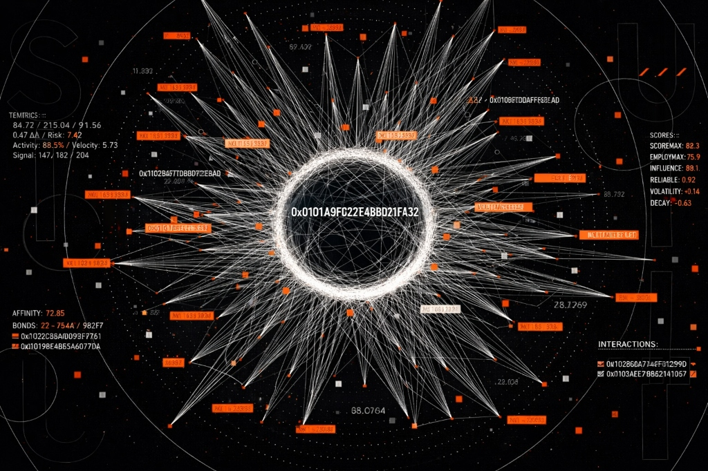

# 🌐 SUHI — Earth2 Identity Layer

**Domain:** https://suhi.yedni.org

---

## 🧠 Overview

SUHI (SCOREMAX Universal HEX Identifier) is a global identity system for Earth2.

It assigns a single immutable HEX identifier to every entity — person, company, place, or system — enabling computation at world scale.

SUHI does not identify records.  
It identifies existence.

---

## 🎯 Core Principle

Identity is absolute.  
Everything else is mutable state.

---

## 🌍 What SUHI Solves

Current systems:
- Identify records
- Fragment identity across platforms
- Encode context into identifiers

SUHI:
- Provides a single, persistent identity
- Removes context from identity
- Enables a unified, computable world model

---

## 🧬 Structure

SUHI is a 96-bit HEX identifier.

| 8 bits | 8 bits | 80 bits |
|--------|--------|---------|
| World  | Type   | Identity |

---

## 📌 Example

0x0101A9F3C27E4B8D91FA32

---

## 🔍 Breakdown

World:
- `0x01` → EARTH2

Entity Type:
- `0x01` → PERSON
- `0x02` → COMPANY
- `0x03` → PLACE
- `0xAA+` → METATYPES

Identity:
- 80-bit HEX
- Random
- Non-semantic
- Immutable
- Globally unique

---

## 📖 Interpretation

`0x01` | `01` | `A9F3C27E4B8D91FA32`

- Exists in EARTH2
- Entity is PERSON
- Identity is permanent and non-derivable

---

## 📜 Rules

- SUHI never includes place, time, or metadata
- SUHI never changes after minting
- Identity is not derived from attributes
- Identity is not reversible
- Identity does not encode meaning

All meaning exists outside the identifier.

---

## 🧩 Entity Model

SUHI applies universally across entities.

PERSON  
COMPANY  
PLACE  
METATYPE  

Each entity:
- Has one SUHI
- Exists independently of context
- Evolves without identity change

---

## ⏳ State vs Identity

Identity:
- Fixed
- Minimal
- Permanent

State:
- Location
- Role
- Relationships
- Scores
- Activity
- Time

State changes. Identity does not.

---

## 🌐 World Model

Earth2 is a graph of SUHIs.

- Each node = a SUHI
- Each edge = a relationship
- Each edge carries state and telemetry

The system models:
- Interaction
- Influence
- Movement
- Growth and decay

SUHI is the anchor.  
SCOREMAX defines the physics.

---

## ⚙️ Why HEX

HEX enables:
- Compact representation
- Trillion-scale capacity
- Machine-native handling
- Non-semantic identity

---

## 🗿 Design Doctrine

Identity must not carry meaning.  
Meaning must emerge from relationships and state.

---

## 🏢 Product Context

SUHI is the identity layer of Earth2.

It enables:
- Persistent entity mapping
- Cross-system identity
- Computable relationship graphs
- Predictive intelligence

---

## 🎬 Experience

The SUHI interface is not a dashboard.

It is:
- A graph
- A field of relationships
- A dynamic system centered on identity

Users:
- Observe a SUHI
- Generate new identities
- Decode existing identities
- Navigate relationships

---

## 🏁 Final Definition

SUHI is a universal, immutable identifier for entities in a computable world.

It represents existence — not information.